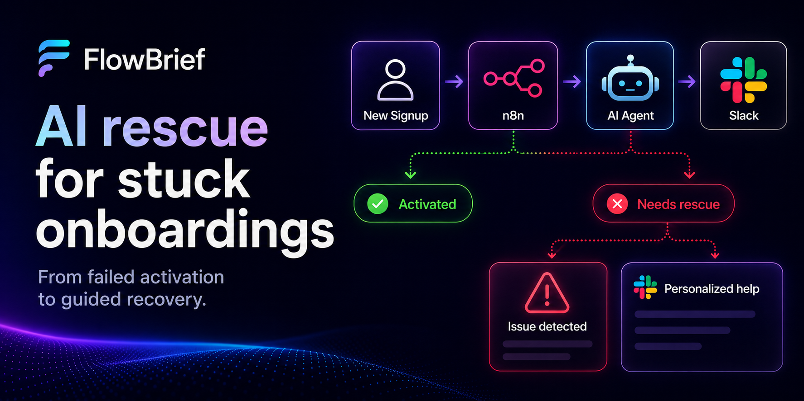

# FlowBrief — an n8n AI agent that rescues stuck onboardings

When a paying customer can't get their first webhook to work, you have a small window before they quietly churn. This repo demos a way to close that window automatically:

> An **n8n agent** watches every new paid signup. If the user hasn't completed activation by the SLA deadline, the agent pulls their failure context, asks an LLM to diagnose the root cause, and posts a Slack message to the admin with a **ready-to-send rescue email tailored to that specific user's failure**.

The repo contains two things:

1. **The n8n rescue agent** — the interesting part. Two workflows running on n8n.
2. **FlowBrief** — a small Next.js/SQLite SaaS the agent monitors. It receives webhooks from users, validates them with structured error codes, and exposes the activation/debug endpoints the agent depends on.

FlowBrief is intentionally minimal. It's the substrate the agent works on, not the point.

---

## How the rescue loop works

```
            ┌───────────────────────┐
  signup →  │ n8n: paid-conversion  │ ── Slack: "New user, SLA starts now"
            └──────────┬────────────┘
                       │  wait 45 min
                       ▼
            ┌───────────────────────────────────┐
            │ GET /api/activation-status?userId │
            └──────────────┬────────────────────┘
                           │
              ┌────────────┴────────────┐
              │                         │
         activated ✅               not activated ⚠️
              │                         │
        Slack: "🎉 onboarded"           ▼
                           ┌─────────────────────────────────┐
                           │ GET /api/activation-debug       │
                           │ (token-protected; returns full  │
                           │  failure context: errorCode,    │
                           │  rawBody, headers, history)     │
                           └──────────────┬──────────────────┘
                                          │
                                          ▼
                           ┌─────────────────────────────────┐
                           │ Switch on errorCode             │
                           │  → MISSING_REQUIRED_FIELD       │
                           │  → INVALID_JSON                 │
                           │  → UNSUPPORTED_CONTENT_TYPE     │
                           │  → ...                          │
                           │ Build error-specific fix hints  │
                           └──────────────┬──────────────────┘
                                          │
                                          ▼
                           ┌─────────────────────────────────┐
                           │ OpenAI (GPT-4o) prompt:         │
                           │  · root-cause analysis          │
                           │  · concrete fix steps           │
                           │  · example curl command         │
                           │  · DRAFT EMAIL (subject + body) │
                           │    addressed to the actual user │
                           └──────────────┬──────────────────┘
                                          │
                                          ▼
                           Slack: full diagnosis + draft email
                                          │
                                          ▼
                                wait 30s, re-check activation
                                          │
                              ┌───────────┴────────────┐
                              ▼                        ▼
                         recovered ✅            still stuck ⚠️
                                                   → escalate
```

The key idea: the same `errorCode` taxonomy that makes the API friendly to integrators (`MISSING_REQUIRED_FIELD`, `INVALID_JSON`, `UNSUPPORTED_CONTENT_TYPE`, …) also makes the rescue agent's job tractable. The LLM doesn't have to guess what went wrong — the API tells it, with full request context, and the LLM's job is to translate that into a sentence the user will actually understand.

---

## Why this is interesting

Activation is one of the highest-leverage moments in a SaaS funnel: a user who completes their first successful action retains at dramatically higher rates than one who doesn't. The traditional fix is a generic "having trouble?" email blast. This is the opposite — every rescue message is grounded in the **exact** failed request the user sent, including the request body, the headers, and the structured error the API returned.

That's only possible because:

- The webhook API logs every request (success or failure) with full context, so the agent has something to read.
- The error response is **structured** (`errorCode` + `errorDetails`), so the agent can branch deterministically before involving the LLM.
- The debug endpoint is **token-protected**, so the agent can pull privileged context without exposing it to the public webhook.

Take any of those three away and the loop falls apart.

---

## The two n8n workflows

Both workflows live in n8n (managed via the [Synta MCP](https://github.com/syntax-fm/synta-mcp) server from Claude Code, not committed as JSON in this repo). IDs:

| Workflow | ID | Status | Webhook path |
| --- | --- | --- | --- |
| **Paid conversion → Activation rescue (simple)** | `Xs7MPdACbBYwXruW` | Active | `/webhook/paid-conversion` |
| **Activation SLA + AI Rescue Loop** | `CJY7NTNz0UCzYxG4` | Active | `/webhook/flowbrief/new-user` |

The first is a minimal SLA monitor — Slack ping at signup, Slack ping at the deadline saying activated/not. The second is the full agent described above. See [FORPIERRE.md](./FORPIERRE.md) for the full story behind both.

**Trigger the agent (test):**

```bash
curl -X POST "https://<n8n-instance>/webhook-test/flowbrief/new-user" \
  -H "Content-Type: application/json" \
  -d '{"userId": "user-123", "email": "test@example.com", "plan": "pro"}'
```

**Connecting n8n to FlowBrief.** The rescue workflow calls *back* into FlowBrief's API (`/api/activation-status`, `/api/activation-debug`). n8n is remote and FlowBrief runs locally in development, so it can't reach `localhost` — expose FlowBrief with a tunnel (e.g. ngrok) and set the workflow's `flowbriefBaseUrl` to the tunnel URL. This is the quick way to run the loop end-to-end locally; a deployed FlowBrief would use its own public URL instead.

---

## FlowBrief (the backend)

Stripped-down Next.js 16 + SQLite + Prisma + NextAuth v5. The endpoints that matter for the agent:

### `POST /api/ingest/[userId]`

The webhook the user's automations point at. Validates method, content-type, payload size (20KB max), user existence, JSON parsing, and schema. Logs every request as `webhook_received`; logs failures additionally as `webhook_failed` with `errorCode`, `rawBody` (truncated and secret-redacted), and whitelisted headers. On success it stores a `SUCCESS` brief immediately (so activation is never blocked), then enriches it with an AI summary + action items in a background task (Next `after()`) — the OpenAI call (`gpt-3.5-turbo`) is off the request path and falls back to a deterministic summary when `OPENAI_API_KEY` is unset or the call fails.

**Required:** `title` (string), `content` (string)
**Optional:** `source` (string), `timestamp` (ISO 8601)

```bash
curl -X POST http://localhost:3000/api/ingest/YOUR_USER_ID \
  -H "Content-Type: application/json" \
  -d '{"title": "Payment Received", "content": "$49.00 processed."}'
```

**Success:** `{ "ok": true }`

**Failure:**

```json
{
  "ok": false,
  "errorCode": "MISSING_REQUIRED_FIELD",
  "errorDetails": { "field": "title", "message": "Required field 'title' is missing" }
}
```

**Error codes:** `INVALID_METHOD` (405), `USER_NOT_FOUND` (404), `UNSUPPORTED_CONTENT_TYPE` (415), `PAYLOAD_TOO_LARGE` (413), `INVALID_JSON` (400), `MISSING_REQUIRED_FIELD` (422), `INVALID_FIELD_TYPE` (422).

### `GET /api/activation-status?userId=...`

Public. "Has this user successfully sent at least one valid webhook?" Used by the dashboard and the simple workflow.

### `GET /api/activation-debug?userId=...`

Token-protected (requires `x-internal-token: $INTERNAL_API_TOKEN`). Returns the full diagnostic context the AI agent needs:

- `activated`
- `lastAttemptAt`
- `lastFailure` — `errorCode`, `errorDetails`, `rawBody`, `headers`
- `recentFailures` — last 5 with timestamps and codes
- `lastReceived` — most recent `webhook_received` event metadata

This is the endpoint the rescue workflow calls before involving the LLM.

---

## Setup

```bash
npm install
cp .env.example .env  # fill in the values below
npx prisma db push
npm test               # optional: run the test suite (offline, zero-config)
npm run dev
```

`.env`:

```env
DATABASE_URL="file:./dev.db"
AUTH_SECRET="..."          # openssl rand -base64 32
AUTH_URL="http://localhost:3000"
INTERNAL_API_TOKEN="..."   # used by the n8n agent for /api/activation-debug
OPENAI_API_KEY="sk-..."    # optional; enables AI brief generation + `npm run eval`
```

| Variable | Required | Purpose |
| --- | --- | --- |
| `DATABASE_URL` | ✅ | SQLite path |
| `AUTH_SECRET` | ✅ | NextAuth session encryption |
| `AUTH_URL` | ✅ | App base URL |
| `INTERNAL_API_TOKEN` | ✅ | Auth for `/api/activation-debug` |
| `OPENAI_API_KEY` | ⛔ | Optional. Ingest uses it to AI-generate brief summaries + action items; falls back to a deterministic summary if unset. Also needed for `npm run eval`. (The n8n agent uses its own cred.) |

---

## Tech stack

- **Backend:** Next.js 16 (App Router) · TypeScript · Tailwind v4
- **Data:** SQLite via Prisma · NextAuth v5 (credentials, JWT sessions)
- **Agent:** n8n workflows (managed via Synta MCP) · OpenAI GPT-4o · Slack

## Testing & evals

```bash
npm test           # Vitest — unit + integration + contract tests. Offline, ~3s.
npm run eval       # LLM eval harness — hits the OpenAI API, run manually.
```

`npm test` is zero-config: a Vitest `globalSetup` spins up a throwaway SQLite database and the suite runs fully offline. It covers the validation / error / redaction libraries, the ingest and activation-debug routes, and a lock test that freezes the `errorCode` taxonomy the n8n agent depends on.

`npm run eval` is a separate layer that exercises the **vendored rescue prompt** (`src/lib/rescue-prompt.ts`) against the real OpenAI API — `golden`, `conformance`, `inject`, and `judge` suites. It needs `OPENAI_API_KEY` and costs tokens, so it runs on demand, never as part of `npm test`. See [evals/README.md](./evals/README.md).

## Further reading

- [FORPIERRE.md](./FORPIERRE.md) — full design notes, architecture decisions, and bug post-mortems (the activation FK crash, the error-taxonomy refactor, the dual-logging design)
- [N8N-CHECKLIST.md](./N8N-CHECKLIST.md) — the n8n-side guardrails to apply by hand (prompt-injection fencing, output schema validation, timeout/retry, rescue-call ceiling, trigger dedup)
- [evals/README.md](./evals/README.md) — the LLM eval harness: what each suite checks and how to run it
- [CLAUDE.md](./CLAUDE.md) — orientation for Claude Code working in this repo
